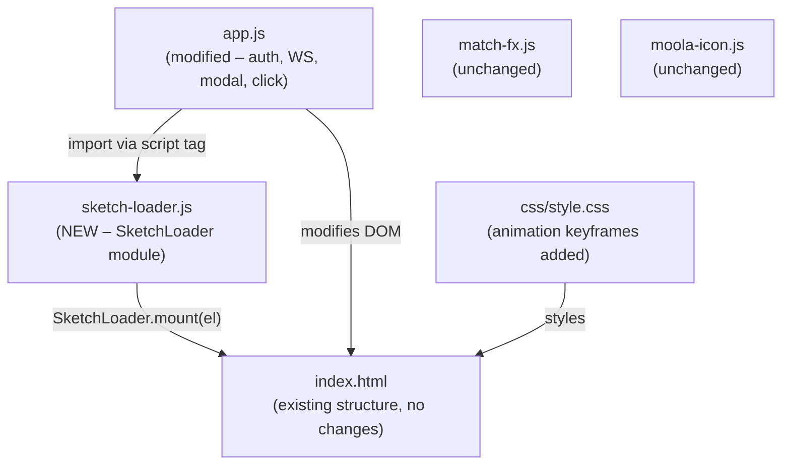
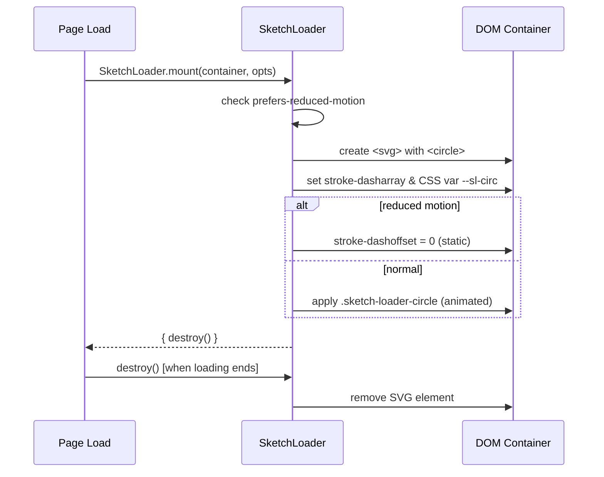
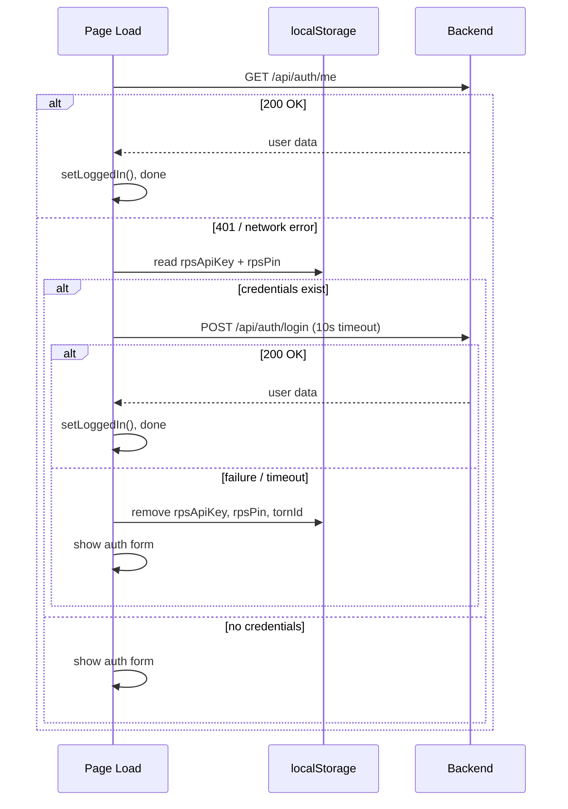
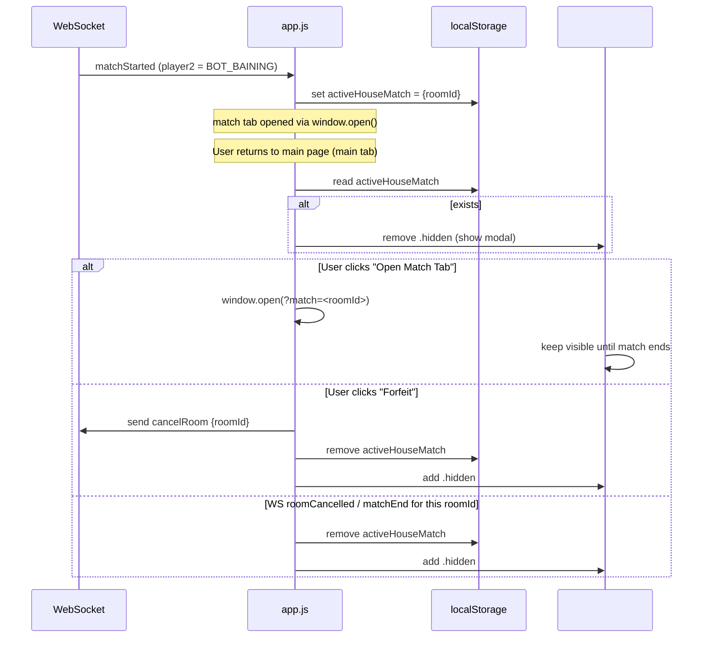

# Design Document: UX Enhancements

## Overview

Five focused UX improvements for the RPS Battle app. All changes are purely frontend (vanilla JS + CSS) except where noted. The backend API is unchanged. Work is organized by feature, each with its own component boundary, so changes are incremental and independently shippable.

The five features are:

1. **Sketch_Loader** — reusable SVG circle-draw animation replacing CSS spinners
2. **Auto Login fallback** — persist `rpsApiKey`/`rpsPin` on login; retry on session expiry
3. **Return-to-Match modal** — wire the existing `#return-match-modal` to active house-match state
4. **Waiting overlay** — show `#match-tab-waiting` while room is `WAITING`, hide on `matchStarted`
5. **Player profile click** — extend existing hover card to trigger on click/tap as well

---

## Architecture



The only new file is `sketch-loader.js`. All other changes are in `app.js` and `style.css`.

---

## Feature 1: Sketch_Loader

### Component Interface

```javascript
// sketch-loader.js — global module, no imports required
const SketchLoader = {
  /**
   * Mount an animated SVG circle-draw loader into `container`.
   * Replaces any existing content in the container.
   * Respects prefers-reduced-motion: shows static circle if reduced.
   * Returns a handle with a destroy() method.
   *
   * @param {Element} container  - DOM element to mount into
   * @param {object}  [opts]     - optional config
   * @param {number}  [opts.size=64]          - SVG size in px
   * @param {number}  [opts.strokeWidth=3.5]  - stroke width
   * @param {string}  [opts.color='#163e79']  - stroke color (--ink default)
   * @returns {{ destroy: () => void }}
   */
  mount(container, opts) {}
};
```

### SVG Animation Design

The animation uses a single `<circle>` element with `stroke-dasharray` set to the full circumference, and `stroke-dashoffset` animated between 0 (fully drawn) and the full circumference (fully erased).

```
circumference = 2 * π * r   (r = (size/2) - strokeWidth - 2)
```

Two CSS keyframe phases in sequence:
- **Draw phase** (0% → 50%): `stroke-dashoffset` goes from circumference → 0
- **Erase phase** (50% → 100%): `stroke-dashoffset` goes from 0 → circumference

Animation duration: 1600ms, `linear`, `infinite`. Total cycle = 1600ms (within the 1200–2000ms requirement).

For `prefers-reduced-motion`: skip the animation; render the circle fully drawn (static).

### CSS Classes

```css
/* Added to style.css */

.sketch-loader-svg {
  display: block;
}

.sketch-loader-circle {
  fill: none;
  stroke-linecap: round;
  animation: sketchLoaderDraw 1.6s linear infinite;
}

@keyframes sketchLoaderDraw {
  0%   { stroke-dashoffset: var(--sl-circ); }
  50%  { stroke-dashoffset: 0; }
  100% { stroke-dashoffset: var(--sl-circ); }
}

@media (prefers-reduced-motion: reduce) {
  .sketch-loader-circle {
    animation: none;
    stroke-dashoffset: 0;  /* static fully-drawn circle */
  }
}
```

### Mount Points

| Element | Current content | After |
|---------|-----------------|-------|
| `#auto-login-loading .auto-login-pulse` | `<span class="pulse-fist">✊</span>` | replaced by `SketchLoader.mount()` |
| `#match-tab-waiting .auto-login-spinner` | CSS border spinner div | replaced by `SketchLoader.mount()` |
| `#waiting-room-panel .waiting-room-spinner` | CSS border spinner div | replaced by `SketchLoader.mount()` |

### Sequence Diagram



---

## Feature 2: Auto Login Fallback

### Current State

The IIFE at the bottom of `app.js` already calls `GET /api/auth/me` on page load. If it returns 200 → `setLoggedIn()`. If it fails → show auth form. Credentials saved: only `tornId` in localStorage.

### Enhancement

On manual login success: also persist `rpsApiKey` and `rpsPin` in `localStorage`.  
On `GET /api/auth/me` failure: attempt `POST /api/auth/login` with saved credentials before giving up.

### Data Flow



### Key Changes to `app.js`

**On manual login success** (inside `authForm` submit handler, after `setLoggedIn`):

```javascript
// Save credentials for fallback auto-login
localStorage.setItem('rpsApiKey', key);
localStorage.setItem('rpsPin', pin);
localStorage.setItem('tornId', data.user.torn_id);
```

**On logout** (inside `logoutBtn` click handler):

```javascript
localStorage.removeItem('tornId');
localStorage.removeItem('rpsApiKey');
localStorage.removeItem('rpsPin');
```

**In the init IIFE**, after `GET /api/auth/me` fails:

```javascript
const savedKey = localStorage.getItem('rpsApiKey');
const savedPin = localStorage.getItem('rpsPin');
if (savedKey && savedPin) {
  // attempt fallback login — setAutoLoginLoading(true) already called
  try {
    const controller = new AbortController();
    const timeout = setTimeout(() => controller.abort(), 10000);
    const res = await fetch('/api/auth/login', {
      method: 'POST',
      credentials: 'same-origin',
      headers: { 'Content-Type': 'application/json' },
      body: JSON.stringify({ api_key: savedKey, pin: savedPin }),
      signal: controller.signal
    });
    clearTimeout(timeout);
    if (res.ok) {
      const data = await res.json();
      if (data.success && data.user) {
        setLoggedIn(data.user);
        connectWS();
        setAutoLoginLoading(false);
        return;
      }
    }
  } catch (_) {}
  // fallback failed — clear stale credentials
  localStorage.removeItem('rpsApiKey');
  localStorage.removeItem('rpsPin');
  localStorage.removeItem('tornId');
}
```

### Security Notes

- `rpsApiKey` and `rpsPin` are stored in `localStorage` as plaintext. This is consistent with how `tornId` is currently stored and acceptable for the app's threat model (single-user browser, no shared-device concern beyond the existing `tornId`).
- Credentials are cleared on explicit logout and on failed fallback, minimizing the window of exposure.

---

## Feature 3: Return-to-Match Modal

### Current State

`#return-match-modal` exists in `index.html` with `#reopen-match-tab-btn` and `#forfeit-match-btn`, currently always `.hidden`. No JavaScript wires it up.

### State Storage

A new `localStorage` key `activeHouseMatch` holds a JSON string `{"roomId": "<id>"}` when the user is in a house match. This key is:

- **Set** when a `matchStarted` WS message arrives and `player2Id === 'BOT_BAINING'`
- **Cleared** when `matchEnd`, `roomCancelled` (for that room), or the user forfeits

### Show/Hide Logic



### Detection: "User is on the main page with an active match"

The modal should show when:

1. The main page loads and `activeHouseMatch` is set in localStorage (handles page refresh or navigation back)
2. `matchStarted` fires for a bot match **and** `openMatchInNewTab` is true (match was sent to new tab)

The modal should **not** show in the match-only tab (`matchOnlyMode === true`).

### Key Changes to `app.js`

```javascript
// --- New helpers ---

const returnMatchModal = $('#return-match-modal');
const reopenMatchTabBtn = $('#reopen-match-tab-btn');
const forfeitMatchBtn = $('#forfeit-match-btn');

function setActiveHouseMatch(roomId) {
  localStorage.setItem('activeHouseMatch', JSON.stringify({ roomId }));
}

function clearActiveHouseMatch() {
  localStorage.removeItem('activeHouseMatch');
}

function getActiveHouseMatch() {
  try {
    return JSON.parse(localStorage.getItem('activeHouseMatch') || 'null');
  } catch { return null; }
}

function showReturnMatchModal(roomId) {
  if (matchOnlyMode) return;  // never show in match tab
  const modal = returnMatchModal;
  if (!modal) return;
  modal.classList.remove('hidden');
}

function hideReturnMatchModal() {
  returnMatchModal?.classList.add('hidden');
}

function checkAndShowReturnMatchModal() {
  const active = getActiveHouseMatch();
  if (active?.roomId && !matchOnlyMode) {
    showReturnMatchModal(active.roomId);
  }
}

// Wire buttons
reopenMatchTabBtn?.addEventListener('click', () => {
  const active = getActiveHouseMatch();
  if (!active?.roomId) return;
  window.open(`${location.origin}${location.pathname}?match=${encodeURIComponent(active.roomId)}`, '_blank');
});

forfeitMatchBtn?.addEventListener('click', () => {
  const active = getActiveHouseMatch();
  if (!active?.roomId) return;
  sendWs({ action: 'cancelRoom', tornId: currentUser?.torn_id, roomId: active.roomId });
  clearActiveHouseMatch();
  hideReturnMatchModal();
});
```

**In `handleWsMessage`**:

- `matchStarted` case, when `data.player2Id === 'BOT_BAINING'` and `openMatchInNewTab`: call `setActiveHouseMatch(data.roomId)` and `showReturnMatchModal(data.roomId)`
- `matchEnd` case: if `getActiveHouseMatch()?.roomId === data.roomId` → `clearActiveHouseMatch()`, `hideReturnMatchModal()`
- `roomCancelled` case: if `getActiveHouseMatch()?.roomId === data.roomId` → `clearActiveHouseMatch()`, `hideReturnMatchModal()`

**In `setLoggedOut`**: call `clearActiveHouseMatch()` and `hideReturnMatchModal()`.

**In init IIFE** (after login, before `return`): call `checkAndShowReturnMatchModal()`.

---

## Feature 4: Waiting Overlay

### Current State

`#match-tab-waiting` exists in `index.html` and is always `.hidden`. No JS shows or hides it.

This overlay is intended for use in **match-only mode** (`matchOnlyMode === true`, i.e. the `?match=<roomId>` tab), when the room status is `WAITING` (no opponent yet).

### Show/Hide Conditions

| Event | Action |
|-------|--------|
| `matchOnlyMode` is true AND WebSocket `identified` fires AND we send `joinRoom` for a room that doesn't immediately start | Show overlay |
| `matchStarted` WS message arrives for `currentRoomId` | Hide overlay |
| `roomCancelled` WS message arrives for `currentRoomId` | Hide overlay (message shown separately) |

The room's initial status is communicated implicitly: if we join a room and receive `matchStarted` immediately, the overlay would flash for an instant. To avoid this, the overlay should only be shown after joining if the room is still in `WAITING` state — signaled by **not** receiving `matchStarted` within the same tick.

The simplest safe approach: show the overlay when `identified` fires in match-only mode (the tab was opened because a room exists but an opponent hasn't joined yet). Hide it immediately on `matchStarted`.

### Key Changes to `app.js`

```javascript
const matchTabWaiting = $('#match-tab-waiting');
const matchTabWaitingRoom = $('#match-tab-waiting-room');

function showMatchTabWaiting(roomId) {
  if (!matchOnlyMode) return;
  if (matchTabWaitingRoom) matchTabWaitingRoom.textContent = roomId || '';
  matchTabWaiting?.classList.remove('hidden');
  // disable choice buttons while waiting
  enableChoices(false);
}

function hideMatchTabWaiting() {
  matchTabWaiting?.classList.add('hidden');
}
```

**In `handleWsMessage`**:

- `identified` case, when `matchOnlyMode && directMatchRoomId`: after sending `joinRoom`, call `showMatchTabWaiting(directMatchRoomId)`
- `matchStarted` case: call `hideMatchTabWaiting()` (before all other match-start logic)
- `roomCancelled` case: call `hideMatchTabWaiting()`

**Sketch_Loader integration**: after the DOM is ready, replace `.auto-login-spinner` inside `#match-tab-waiting` with `SketchLoader.mount()`.

---

## Feature 5: Player Profile Click

### Current State

`app.js` wires:
- `mouseover` → `showHoverForButton()` → `showProfileHoverCard()`
- `mousemove` → `positionHoverCard()`
- `mouseout` → `hideProfileHoverCard()` (with 300ms delay)

The existing `click` handler for `.player-profile-btn` and `.player-avatar-btn` calls `openProfileModal()`, which opens the user's own stats modal (not ideal for opponents).

### Enhancement

On `click` on a `.player-profile-btn` or `.player-avatar-btn`: toggle the hover card for that player at the click position. If the hover card is already visible for the same player, hide it (toggle). If a different player is clicked while a card is open, switch to the new player.

This reuses `showProfileHoverCard` and `hideProfileHoverCard` exactly. No new UI is needed.

### State Tracking

```javascript
let hoverCardPinnedTornId = null;  // tornId of the currently click-pinned profile, or null
```

### Click Handler Change

Replace the current `click` handler for `.player-profile-btn, .player-avatar-btn` (which calls `openProfileModal` / `showPlayerProfile` / `showBotProfile`) with:

```javascript
document.addEventListener('click', (e) => {
  const btn = e.target.closest('.player-profile-btn, .player-avatar-btn');
  if (!btn) {
    // click outside — dismiss pinned card
    if (hoverCardPinnedTornId) {
      hoverCardPinnedTornId = null;
      hideProfileHoverCard();
    }
    return;
  }
  e.preventDefault();
  const tornId = btn.dataset.tornId;
  if (!tornId) return;

  if (hoverCardPinnedTornId === tornId) {
    // toggle off
    hoverCardPinnedTornId = null;
    hideProfileHoverCard();
    return;
  }

  hoverCardPinnedTornId = tornId;
  showHoverForButton(btn, e.pageX, e.pageY);
});
```

### Mouse-out Suppression When Pinned

The existing `mouseout` handler calls `hideProfileHoverCard()` after 300ms. When the card is pinned (click mode), suppress this:

```javascript
document.addEventListener('mouseout', (e) => {
  if (hoverCardPinnedTornId) return;  // pinned by click — don't auto-hide
  // ... existing mouseout logic
});
```

### Keyboard Accessibility

Add `keydown` listener: when `Escape` is pressed, clear the pinned state and hide the hover card.

```javascript
document.addEventListener('keydown', (e) => {
  if (e.key === 'Escape' && hoverCardPinnedTornId) {
    hoverCardPinnedTornId = null;
    hideProfileHoverCard();
  }
});
```

---

## Components and Interfaces

### SketchLoader (new — `sketch-loader.js`)

**Purpose**: Renders and manages the SVG circle-draw animation on any loading surface.

**Interface**:

```javascript
const SketchLoader = {
  /**
   * Mount a sketch-loader SVG into the given container.
   * @param {Element} container
   * @param {{ size?: number, strokeWidth?: number, color?: string }} [opts]
   * @returns {{ destroy: () => void }}
   */
  mount(container, opts) {}
};
```

**Responsibilities**:
- Create and append an `<svg>` with a single animated `<circle>` into `container`
- Detect `prefers-reduced-motion` and suppress animation if active
- Clean up the SVG element when `destroy()` is called

---

### Auto_Login_Module (modified — `app.js` init IIFE)

**Purpose**: Attempts session restoration on page load; falls back to credential-based login if session is expired.

**Interface** (internal — not a public API):

```javascript
// Called automatically on DOMContentLoaded via async IIFE
async function initAutoLogin(): Promise<void>
// Helpers:
function saveCredentials(apiKey: string, pin: string): void   // called on manual login
function clearCredentials(): void                              // called on logout / failed fallback
```

**Responsibilities**:
- Call `GET /api/auth/me`; on success, transition to logged-in state
- On failure, read `rpsApiKey` + `rpsPin` from localStorage and call `POST /api/auth/login` with a 10-second timeout
- On any failure, clear stored credentials and show the auth form
- Keep the auto-login loading screen visible throughout the attempt

---

### ReturnMatchModal (modified — `app.js`)

**Purpose**: Warns users returning to the home page that a house match is still active.

**Interface** (internal):

```javascript
function setActiveHouseMatch(roomId: string): void
function clearActiveHouseMatch(): void
function getActiveHouseMatch(): { roomId: string } | null
function showReturnMatchModal(roomId: string): void
function hideReturnMatchModal(): void
function checkAndShowReturnMatchModal(): void
```

**Responsibilities**:
- Persist active house match room ID in localStorage key `activeHouseMatch`
- Show `#return-match-modal` when a bot match is in progress and user is on the main page
- Wire "Open Match Tab" to `window.open(?match=<roomId>)`
- Wire "Forfeit" to send WS `cancelRoom` and clear state
- Auto-dismiss on `matchEnd` or `roomCancelled` for the tracked room

---

### WaitingOverlay (modified — `app.js`)

**Purpose**: Provides a visual hold screen inside the match-only tab while the room is still in `WAITING` state.

**Interface** (internal):

```javascript
function showMatchTabWaiting(roomId: string): void
function hideMatchTabWaiting(): void
```

**Responsibilities**:
- Show `#match-tab-waiting` with the room code when in match-only mode and waiting for an opponent
- Disable choice buttons while overlay is visible
- Hide on `matchStarted` or `roomCancelled`

---

### ProfileHoverCard (modified — `app.js`)

**Purpose**: Displays player statistics adjacent to the clicked or hovered profile element.

**Interface** (extended — existing functions plus new state):

```javascript
// Existing (unchanged signature):
function showProfileHoverCard(profile, x, y): void
function hideProfileHoverCard(): void
function showHoverForButton(btn, pageX, pageY): void

// New state variable:
let hoverCardPinnedTornId: string | null  // null = hover-only mode
```

**Responsibilities**:
- Show hover card on `mouseover` (existing behavior, unchanged)
- On `click` of `.player-profile-btn` / `.player-avatar-btn`: pin the card for that player; toggle off on second click of same player
- Suppress `mouseout` auto-hide when card is click-pinned
- Dismiss pinned card on `Escape` key or click outside

---

## Correctness Properties

### Property 1: SketchLoader circumference invariant

**Validates: Requirements 4.1, 4.3**

**Description**: For any valid `size` ∈ [16, 512], the computed circumference `2 * π * (size/2 - strokeWidth - 2)` equals the SVG circle's `stroke-dasharray` attribute value (within floating-point epsilon).

**Rationale**: The circle animation depends on `stroke-dasharray` matching the exact circumference; a mismatch would cause incomplete draw/erase cycles.

**How tested**: Property-based test with fast-check generating random sizes; compute expected circumference and assert it matches the mounted SVG's `stroke-dasharray`.

---

### Property 2: SketchLoader reduced-motion static

**Validates: Requirements 4.7**

**Description**: When `prefers-reduced-motion: reduce` is active, the `<circle>` has `animation: none` and `stroke-dashoffset = 0` (fully drawn; not animating).

**Rationale**: Respects user accessibility preferences; animated content can trigger motion sickness.

**How tested**: Mock `window.matchMedia('(prefers-reduced-motion: reduce)')` to return `{ matches: true }`, mount loader, verify circle's computed style has `animation: none`.

---

### Property 3: SketchLoader destroy cleanup

**Validates: Requirements 4.1**

**Description**: After `destroy()` is called, the SVG element is no longer present in the container.

**Rationale**: Prevents memory leaks and orphaned DOM nodes when loading screens are dismissed.

**How tested**: Call `mount()`, verify SVG exists, call `destroy()`, assert `container.querySelector('svg') === null`.

---

### Property 4: Auto Login credential hygiene

**Validates: Requirements 1.1, 1.4, 1.6**

**Description**: After any sequence of `saveCredentials` / `clearCredentials` / failed-fallback operations, `rpsApiKey` is present in localStorage if and only if `rpsPin` is also present.

**Rationale**: Half-saved credentials (only key or only PIN) would cause a nonsensical fallback login attempt.

**How tested**: Property-based test generating random sequences of save/clear operations; assert at all checkpoints that both keys are present or both are absent.

---

### Property 5: Auto Login timeout bound

**Validates: Requirements 1.5**

**Description**: The fallback login attempt is always resolved (success, failure, or abort) within 10 seconds regardless of network conditions.

**Rationale**: Prevents indefinite hang on page load if the backend is slow or unreachable.

**How tested**: Mock `fetch` to never resolve; verify that after 10 seconds, `AbortController.abort()` is called and the auth form is shown.

---

### Property 6: Auto Login credentials cleared on failure

**Validates: Requirements 1.4**

**Description**: If the fallback `POST /api/auth/login` returns any non-2xx response or the request is aborted, both `rpsApiKey` and `rpsPin` are removed from localStorage before the auth form is shown.

**Rationale**: Stale credentials should not persist after a failed login attempt.

**How tested**: Mock `fetch` to return 401 / 500 / network error / timeout; assert that after the auth form is shown, both keys are absent from localStorage.

---

### Property 7: Return-to-Match modal ↔ localStorage consistency

**Validates: Requirements 2.1, 2.5**

**Description**: `#return-match-modal` is visible if and only if `localStorage.getItem('activeHouseMatch')` is non-null (in the main tab, when the user is logged in).

**Rationale**: The modal is the UI representation of the `activeHouseMatch` state; they must stay in sync.

**How tested**: Simulate `matchStarted` with bot opponent; assert modal is visible and localStorage key is set. Simulate `matchEnd`; assert modal is hidden and key is cleared.

---

### Property 8: Return-to-Match no modal in match-only tab

**Validates: Requirements 2.1**

**Description**: When `matchOnlyMode === true`, `showReturnMatchModal()` is a no-op; the modal is never shown.

**Rationale**: The match tab itself is the match UI — showing a warning modal there would be nonsensical.

**How tested**: Set `matchOnlyMode = true`, call `showReturnMatchModal()`, assert modal remains `.hidden`.

---

### Property 9: Waiting Overlay disables choices

**Validates: Requirements 3.5**

**Description**: When `#match-tab-waiting` is visible, all `.choice-btn` elements have `disabled = true`.

**Rationale**: The user cannot make a move before the opponent has joined; buttons must be disabled to prevent invalid submissions.

**How tested**: Call `showMatchTabWaiting()`, assert all `.choice-btn` have `disabled === true`.

---

### Property 10: Waiting Overlay cleared on start

**Validates: Requirements 3.3**

**Description**: When `matchStarted` is received for `currentRoomId`, `#match-tab-waiting` has the `.hidden` class and choice buttons are enabled.

**Rationale**: The overlay must be dismissed when the match begins to allow gameplay.

**How tested**: Show overlay, simulate `matchStarted` WS message, assert overlay is hidden and `choiceBtns.every(b => !b.disabled)`.

---

### Property 11: Player Profile at most one card visible

**Validates: Requirements 5.5**

**Description**: At any time, at most one `.profile-hover-card` is visible (lacks `.hidden` class).

**Rationale**: Multiple cards would confuse the user and clutter the UI.

**How tested**: Click two different profile buttons in sequence; assert that only the second card is visible (first is hidden or reused).

---

### Property 12: Player Profile toggle off on second click

**Validates: Requirements 5.1**

**Description**: Clicking the same `.player-profile-btn` twice in a row results in the hover card being hidden after the second click.

**Rationale**: Provides an intuitive "pin/unpin" toggle behavior on mobile or desktop click.

**How tested**: Click a profile button once (card visible), click the same button again, assert card is hidden.

---

## Data Models

### localStorage Keys (new)

| Key | Type | Value | Lifecycle |
|-----|------|-------|-----------|
| `tornId` | string | Torn numeric ID | Set on login, removed on logout |
| `rpsApiKey` | string | Torn API key (plaintext) | Set on login, removed on logout or failed fallback |
| `rpsPin` | string | 4-digit PIN (plaintext) | Set on login, removed on logout or failed fallback |
| `activeHouseMatch` | JSON string | `{"roomId": "<id>"}` | Set on bot matchStarted (new tab), cleared on match end/cancel/logout |

### WebSocket Messages (consumed, no backend change)

| Message `action` | Relevant fields | Used by |
|-----------------|-----------------|---------|
| `matchStarted` | `roomId`, `player1Id`, `player2Id` | Feature 3, 4 |
| `matchEnd` | `roomId` | Feature 3 |
| `roomCancelled` | `roomId`, `message` | Feature 3, 4 |
| `identified` | _(none)_ | Feature 4 |

---

## Error Handling

### Auto Login Fallback

| Scenario | Behaviour |
|----------|-----------|
| `AbortController` timeout (10s) | Catch the `AbortError`, clear credentials, show auth form |
| Non-2xx response from `/api/auth/login` | Clear credentials, show auth form |
| `localStorage` unavailable (private browsing) | `getItem` returns null → skip fallback, show auth form normally |

### Return-to-Match Modal

| Scenario | Behaviour |
|----------|-----------|
| WS not connected when forfeit clicked | `sendWs` is a no-op (checks `ws.readyState`); still clear state and hide modal |
| `activeHouseMatch` is malformed JSON | `getActiveHouseMatch()` catches and returns null; modal not shown |
| Match ends naturally at same time as forfeit | `cancelRoom` sent first (user click), then `roomCancelled` WS arrives and clears state |

### Sketch_Loader

| Scenario | Behaviour |
|----------|-----------|
| Container element is null | Early return, no error thrown |
| `destroy()` called on already-destroyed instance | No-op |
| SVG not supported | Degraded gracefully — modern browser baseline assumed |

---

## Testing Strategy

### Unit Testing Approach

- `SketchLoader.mount()`: verify SVG element is appended, circle has correct `stroke-dasharray`, `destroy()` removes the element.
- `getActiveHouseMatch()` / `setActiveHouseMatch()` / `clearActiveHouseMatch()`: test JSON round-trip and null handling.
- Auto-login fallback logic: mock `fetch` and `localStorage`; verify credential cleanup on failure.

### Property-Based Testing Approach

**Property test library**: fast-check (JavaScript)

- **Sketch_Loader size invariant**: for any `size` in [16, 512], `circumference = 2 * π * (size/2 - strokeWidth - 2)` is positive and matches the SVG `stroke-dasharray` attribute.
- **LocalStorage key hygiene**: after any sequence of login/logout/failed-fallback operations, `rpsApiKey` and `rpsPin` are present if and only if `tornId` is also present.

### Integration Testing Approach

- Full login flow: fill form → submit → verify localStorage keys set → reload page → verify auto-login fires (mock `/api/auth/me` to return 401 first, then verify `/api/auth/login` is called).
- Logout: verify all three localStorage keys removed.
- Return-match modal: simulate `matchStarted` WS event with bot opponent, verify modal shown; simulate `roomCancelled`, verify modal hidden.
- Waiting overlay: in match-only mode, simulate `identified` + `joinRoom` flow, verify overlay shown; simulate `matchStarted`, verify overlay hidden.

---

## Performance Considerations

- `SketchLoader` uses CSS animation (GPU-composited `stroke-dashoffset`) — no JavaScript animation loop needed.
- The hover card fetch is already cached via `profileCache` (Map). Click-pin reuses the same fetch path — no extra requests.
- `localStorage` reads happen once at page load init; no polling.

---

## Security Considerations

- `rpsApiKey` stored in `localStorage` is a Torn public API key (read-only scope for events/profile). It is not a password or payment credential. The risk profile is equivalent to the existing `tornId` storage.
- The `activeHouseMatch` value (`roomId`) is an internal room identifier with no intrinsic privilege.
- All fetch calls use `credentials: 'same-origin'` and the existing session/cookie auth — the fallback login simply re-establishes the session.

---

## Dependencies

No new external libraries. The project already uses:

- Vanilla JS (no framework)
- CSS custom properties (`var(--ink)` etc.)
- Browser-native `WebSocket`, `fetch`, `localStorage`
- `fast-check` (for property tests, if test suite is added)

New file:

- `src/main/resources/static/js/sketch-loader.js` — new module, no dependencies
